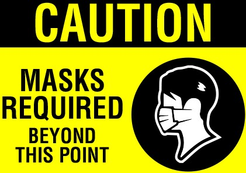
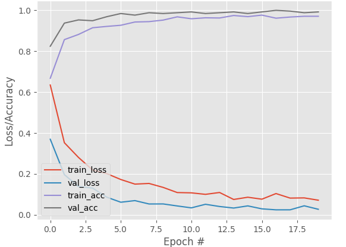
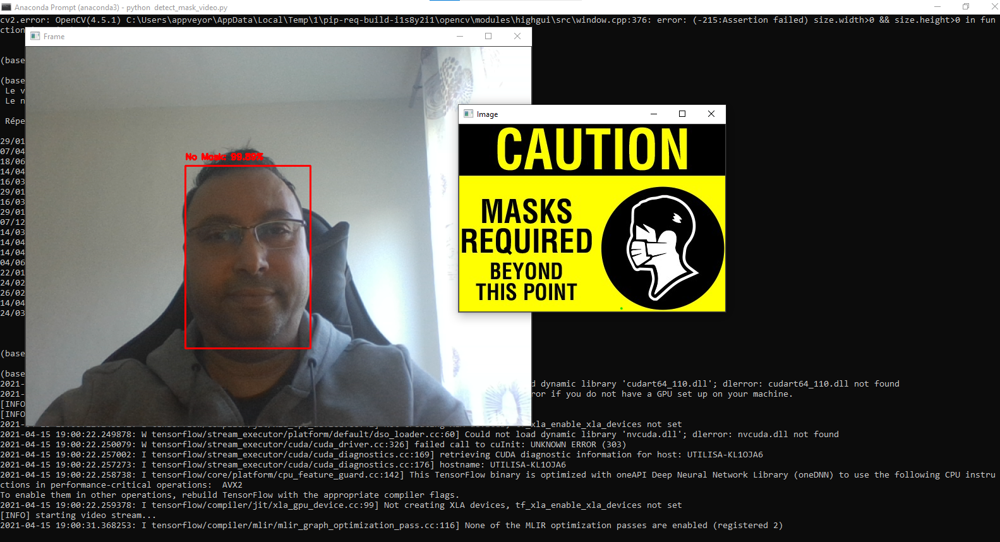
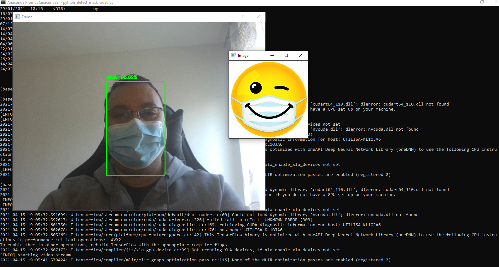

# COVID-19: Détecteur de masque facial avec OpenCV, Keras et TensorFlow:

## Introduction:

Dans ce projet, vous apprendrez à entraîner un détecteur de masque facial COVID-19 avec OpenCV, Keras, TensorFlow et du Deep Learning.
Construire un détecteur de masques sur des images préfaites et en temps réel avec une webcam grace à ces bibliothèques.

L'ensemble de données se compose de ```1376``` images appartenant à deux classes:
Le dataset se compose de ```690``` images ```avec masque``` et ```686``` images ```sans masque```

## Déploiement:

une fois que le détecteur de masque facial est formé, nous pouvons ensuite passer au chargement du détecteur de masque, effectuer une détection de visage, puis classer chaque visage comme "avec_masque" ou "sans_masque"
Par ailleurs un smiley s'affichera selon le cas qui se présente.
<br>


<br>
Dans le cas de non port de masque un son sera joué, avertissant l'usager de porter son masque.

## Dépendnaces:

* Pour installer les packages requis, exécutez:

pip installer tensorflow
pip installer keras
pip installer opencv-python
pip3 install imutils
pip3 install simpleaudio
pip3 install python-vlc

* Les courbes de "précision/perte" d'entraînement du détecteur de masque facial COVID-19 démontrent une grande précision et peu de signes de surajustement sur les données. Nous sommes maintenant prêts à appliquer nos connaissances en vision par ordinateur et en apprentissage en profondeur à l'aide de Python, OpenCV et TensorFlow et Keras pour effectuer la détection des masques faciaux.



## Utilisation de base:
* Pour cloner le projet sur votre ordinateur à partir d'un terminal:
```bash
git clone https://github.com/sialorama/Detecteur-de-masques.git
cd mon_dossier_du_projet
```

## Lancer le programme dans un terminal:

* Detection sur des images examples:
```bash
    mon_dossier_du_projet/python detect_mask_image.py --i image/img1.png
    mon_dossier_du_projet/python detect_mask_image.py --i image/img2.png
```
* Detection via la caméra:
```bash
    mon_dossier_du_projet/python detect_mask_video.py
```

## Rendu:



## Références:
[COVID-19: Face Mask Detector with OpenCV, Keras/TensorFlow](https://www.pyimagesearch.com/2020/05/04/covid-19-face-mask-detector-with-opencv-keras-tensorflow-and-deep-learning/)
